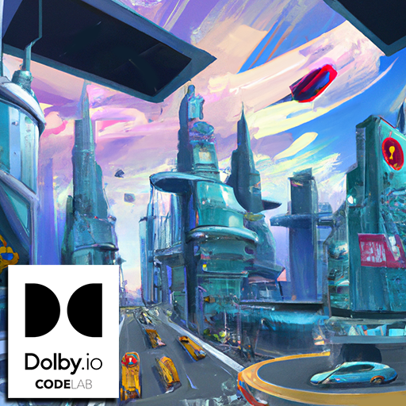

<!-- _coverpage.md -->
<!-- background image -->

<!--  -->

# Learn BabylonJS to Create Your Own 3D Metaverse Environments

> Workshop presented by Dolby.io Developer Relations Team - CascadiaJS 2022

[GitHub Project](https://github.com/dolbyio-samples/workshop-babylonjs-metaverse.git)
[Get Started](#learn-babylonjs-to-create-your-own-3d-metaverse-environments)

<!-- background color -->

