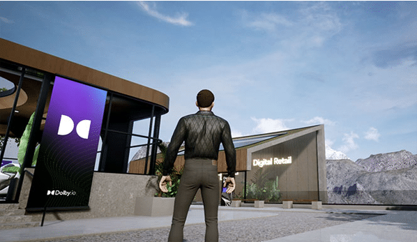

# Real-Time Communications

 ## Creating an immersive Spatial Audio Experience

As extra credit, you can integrate the Spatial Audio interface we just demoed into your Babylon instance. Here are some resources to help you get started:

1. Integrating the Dolby.io Communications SDK

Follow [this quickstart](https://docs.dolby.io/communications-apis/docs/getting-started-with-the-javascript-sdk) to integrate the SDK into the JavaScript code.

2. Establishing Spatial Audio

To use Spatial Audio in a virtual world, we need to be able to define the scene, scale, and position of the users. In this case, each participant is responsible for setting their own position to the server, meaning every individual user node needs to be broadcasting its position, and any changes of position that happen.

Follow [these instructions](https://docs.dolby.io/communications-apis/docs/guides-integrating-shared-spatial-audio) to start addition spatial scenes to your environment. Here's an example, but we suggest customizing it to your specific environment.

```js
// Create a Dolby Voice conference with spatialAudioStyle set to shared
const createOptions = {
  alias: "conference name",
  params: {
    spatialAudioStyle: "shared"
  }
};

const conference = await VoxeetSDK.conference.create(createOptions);

// Join the conference with spatial audio enabled
const joinOptions = {
 spatialAudio: true
};

await VoxeetSDK.conference.join(conference, joinOptions);

// Configure the spatial audio scene and scale
const right = { x: 1, y: 0, z: 0 };
const up = { x: 0, y: 1, z: 0 };
const forward = { x: 0, y: 0, z: 1 };

const axis_scale = 5000 / 100;
const scale = { x: axis_scale, y: axis_scale, z: axis_scale };

VoxeetSDK.conference.setSpatialEnvironment(scale, forward, up, right);

// Set the local participant’s position
const myPosition = ...

VoxeetSDK.conference.setSpatialPosition(VoxeetSDK.session.participant, myPosition);
```

We suggest randomly spawning participants to ensure users are given different initial positions. We want to assign them avatars, and assign the profiles in Spatial.

3. Changing Spatial Direction

When a user changes direction, we want the sound to behave accordingly. To do this, we can simply modify the direction based on X, Y, Z coordinates, as described [here](https://docs.dolby.io/communications-apis/docs/guides-changing-the-spatial-direction), and sending it to the server.

```js
const spatialDirection = {
 x: 0,
 y: 0,
 z: 90,
};

VoxeetSDK.conference.setSpatialDirection(VoxeetSDK.session.participant, spatialDirection);
```

4. Beyond?

This is only the abstract instructions on how to begin implementing spatial audio with Dolby.io Communications. See the examples below for a real world demonstration on how developers are using Dolby.io Spatial Audio in their applications.

## Odyssey Metaverse Demo
Experience Dolby.io Spatial Audio in the metaverse
Odyssey, an immersive metaverse platform, chose Dolby.io Spatial Audio to give users in the metaverse freedom to move and talk with a high-fidelity experience — like when meeting together in-person. For the full experience, try the [demo](https://odyssey.newgameplus.live/#/room/aPsOe2u2HCwxoaGsittS) on a laptop or desktop computer, use headphones, and grab a few friends to join the room.


 
 This experience is best [viewed](https://odyssey.newgameplus.live/#/room/aPsOe2u2HCwxoaGsittS) in chrome in it's own tab.

## Animating Characters

[Audio](https://playground.babylonjs.com/#AHQEIB#17 ':include :type=iframe width=100% height=800px')

View the [Playground](https://playground.babylonjs.com/#AHQEIB#17/)
[Read more](https://doc.babylonjs.com/divingDeeper/animation/animatedCharacter#detailed-workflow) about how this character animation was created.

The basic code loads a specially prepared model with multiple animations, then uses a keypress to change animations. We have walk, idle, walking back and samba.

```
    // Load hero character
    BABYLON.SceneLoader.ImportMesh("", "https://assets.babylonjs.com/meshes/", "HVGirl.glb", scene, function (newMeshes, particleSystems, skeletons, animationGroups) {
        var hero = newMeshes[0];

        //Scale the model down        
        hero.scaling.scaleInPlace(0.1);

        //Lock camera on the character 
        camera1.target = hero;

        //Hero character variables 
        var heroSpeed = 0.03;
        var heroSpeedBackwards = 0.01;
        var heroRotationSpeed = 0.1;

        var animating = true;

        const walkAnim = scene.getAnimationGroupByName("Walking");
        const walkBackAnim = scene.getAnimationGroupByName("WalkingBack");
        const idleAnim = scene.getAnimationGroupByName("Idle");
        const sambaAnim = scene.getAnimationGroupByName("Samba");

        

        //Rendering loop (executed for everyframe)
        scene.onBeforeRenderObservable.add(() => {
            var keydown = false;
            //Manage the movements of the character (e.g. position, direction)
            if (inputMap["w"]) {
                hero.moveWithCollisions(hero.forward.scaleInPlace(heroSpeed));
                keydown = true;
            }
            if (inputMap["s"]) {
                hero.moveWithCollisions(hero.forward.scaleInPlace(-heroSpeedBackwards));
                keydown = true;
            }
            if (inputMap["a"]) {
                hero.rotate(BABYLON.Vector3.Up(), -heroRotationSpeed);
                keydown = true;
            }
            if (inputMap["d"]) {
                hero.rotate(BABYLON.Vector3.Up(), heroRotationSpeed);
                keydown = true;
            }
            if (inputMap["b"]) {
                keydown = true;
            }

            //Manage animations to be played  
            if (keydown) {
                if (!animating) {
                    animating = true;
                    if (inputMap["s"]) {
                        //Walk backwards
                        walkBackAnim.start(true, 1.0, walkBackAnim.from, walkBackAnim.to, false);
                    }
                    else if
                        (inputMap["b"]) {
                        //Samba!
                        sambaAnim.start(true, 1.0, sambaAnim.from, sambaAnim.to, false);
                    }
                    else {
                        //Walk
                        walkAnim.start(true, 1.0, walkAnim.from, walkAnim.to, false);
                    }
                }
            }
            else {

                if (animating) {
                    //Default animation is idle when no key is down     
                    idleAnim.start(true, 1.0, idleAnim.from, idleAnim.to, false);

                    //Stop all animations besides Idle Anim when no key is down
                    sambaAnim.stop();
                    walkAnim.stop();
                    walkBackAnim.stop();

                    //Ensure animation are played only once per rendering loop
                    animating = false;
                }
            }
        });
    });

```