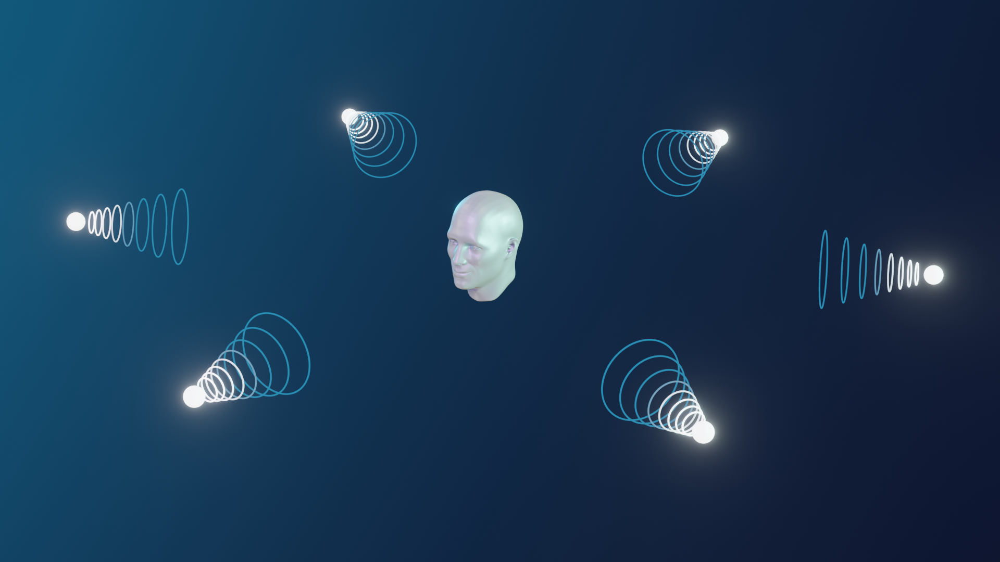

# Spatial Audio and Perception

## What is spatial audio?

Spatial audio allows you to place conference participants spatially in a 3D rendered audio scene and hear the audio from the participants rendered at the given locations. This feature replicates audio conditions similar to real conference room conditions to make virtual meetings more natural and realistic. The application configures the audio scene and then gives the positions for the participants in the conference. The application can also change the position the scene is heard from in 3D space.

[Audio](https://developer.dolby.io/demos/spatial-audio/ ':include :type=iframe width=100% height=800px')

## Individual spatial audio: video conferencing

In the individual spatial audio scene, each participant creates a unique scene by setting the positions for all participants. This way, each participant can hear a different spatial audio scene.

A video conferencing application would use spatial audio to map each participant's audio to the same location as their video on the screen. For example, if a participant’s video is shown to the left of the screen, the audio from that participant would be heard from the left. This is known as “Audio/Video congruence”.

The A/V congruent audio scene is set up by defining the rectangle that represents the scene in the application window. Normally this would be the rectangle that the video conference is being shown in. The participants’ positions are then expressed by the positions of their video tiles.

Tiles can be arranged in any way desired by the application developer, though some common examples might include:

- A grid view of equally sized tiles
- A grid view of different sized tiles
- A large main presenter tile with tiles for the rest of the participants in a line underneath
- A panel, where the tiles are arranged as if the participants were sitting at a panel table facing the audience

## Shared spatial audio: virtual spaces

In a shared spatial audio scene, all participants contribute to the shared scene by setting their positions only. All participants are heard from the positions they set.

In a virtual space, the conference is often audio-only. Various presentation styles are available, such as a top-down 2D map or a style that resembles a 3D game. Each participant in the conference is shown in the space as an avatar. The audio for the other participants appears to come from the position shown for their avatar. Participants can move themselves around the space and see others move as well. The audio scene updates as the participants move. Virtual spaces can be applied to applications such as 2D or 3D games, trade shows, virtual museums, water cooler scenarios, etc.

Learn about Dolby.io [Spatial Audio](https://developer.dolby.io/demos/spatial-audio/)

